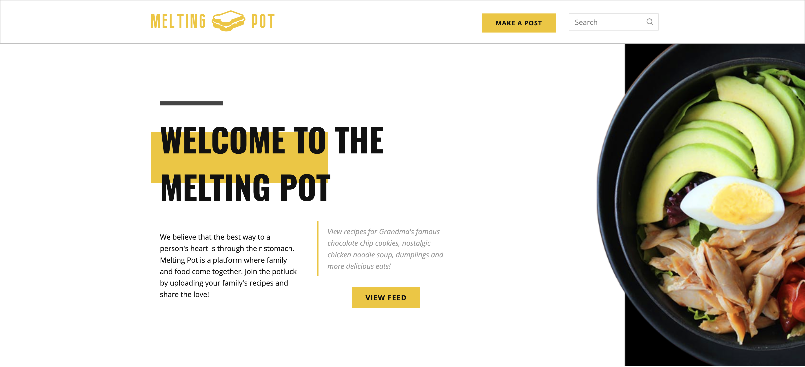

## About
### Hi, my name is Kevin Yin
I am currently a junior at NYU Stern studying Finance as well as Computing and Data Science with a minor in Mathematics and Computer Science. I am interested in data analytics, data engineering, and product management.

<a href="https://www.linkedin.com/in/kyin/" target="_blank">Click here to check out my LinkedIn</a> 

## Projects

Melting Pot

 
As a part of Major League Hacking's "Hacky Birthday MLH" hackathon, I worked with two friends to create Melting Pot, a social media website for sharing family recipes. Our social media website has a backend MongoDB database connected with a Node.js/Express.js application to act as an API. This is all then deployed with Heroku. The frontend was coded in HTML/CSS/JavaScript and was then connected to the backend using Flask. Some key features include the ability to upload recipes along with an image, comment, and dynamic frontend refreshing.
 

Wordle Solving Algorithm

 
After studying machine learning algorithms such as neural networks, k-means clustering, and Naive Bayes throughout the semester, I worked on a project to create algorithms to solve the word-game Wordle with two other teammates. I coded Wordle, then my teammates and I each created separate algorithms based on different strategies to solve Wordle. After measuring the efficiency of each of our algorithms, we also utilized q-learning to see if we could create a more efficient algorithm by combining our three separate methods.
 
<embed src="https://kyin01.github.io/Wordle Presentation.pdf" width="100%" height="850px"/>

SNAP Food Assistance Modeling

 
As a member of NYU's Business Analytics Club Insight Team, I spent a semester learning different types of regression models such as linear regressions and random forests as well as data management and analytics with python and SQL. As a part of a 4 person team, we looked into a dataset regarding SNAP, a food assistance program across the US. As a team, we cleaned the data using SQL and applied different models with Python to try and predict funding based on key demographics.
 
<embed src="https://kyin01.github.io/Food Assistance Presentation.pdf" width="100%" height="850px"/>

